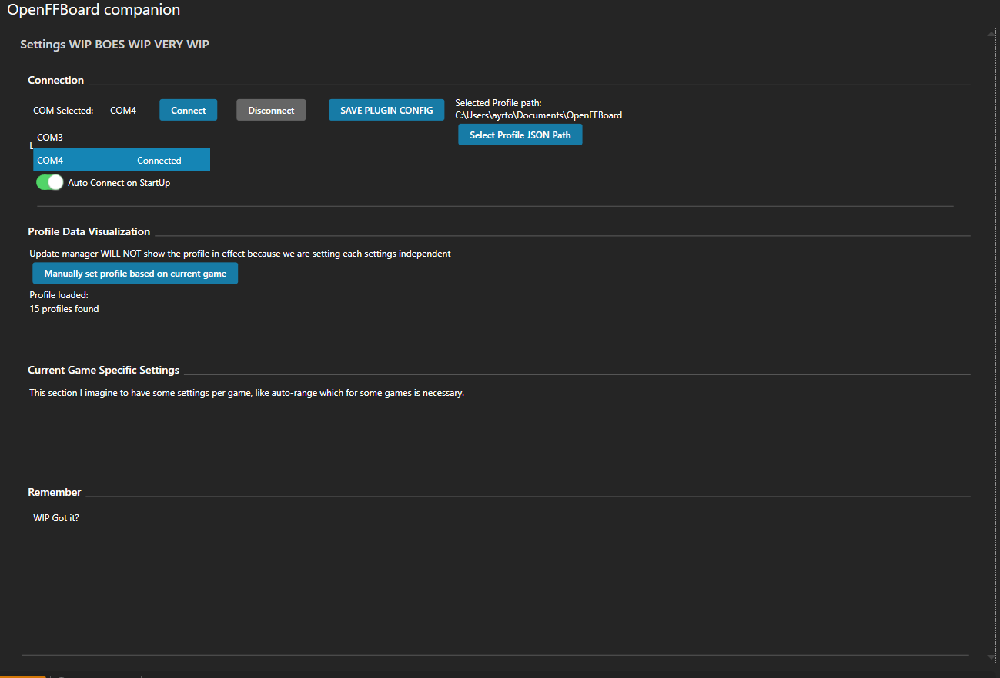

# OpenFFBoardPlugin

Minimal Plugin for integrating OpenFFBoard to Simhub.

**this project is a work in progress atm**

## Features

- WIP

## How to use

- Go to [releases](https://github.com/AyrtonRicardo/OpenFFboardPlugin/releases)
- Download `OpenFFBoardPlugin.zip`
- Copy the dll's from inside the zip to your simhub installation folder.
- Make sure you restart SimHub.
- Click `Add/Remove features` in your simbub.
- Search for `OpenFFBoard`
- Include it and make sure select "show in left menu"

The plugin looks at moment like this:

## Contributing

- Clone the repository.
- Build
- Set the debug target to external program and set it so simhub main exe (typically C:\Program Files (x86)\SimHub\SimHubWPF.exe)
- Start ! You are ready to go !

Notes :

- Simhub DLL references are linked using the SIMHUB_INSTALL_PATH environment variable so they are always pointing to the latest DLLs coming with simhub, when adding new dll coming from simhub edit manually the csproj to make them point to simhub latest version using SIMHUB_INSTALL_PATH
- A post build event copy is set to copy the dll and pdb to the simhub install directory. If you add dependencies, please make sure :
- That they do not conflict with simhub ones
- To add them to the post build copy

## License

MIT